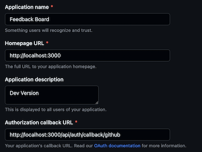

# Portfolio Project

This Project uses the following technologies

- NextJs 13 with app directory
- Server components, where possible
- Data streaming for lists to provide better UX
- Data validation on server with zod
- ORM: Prisma
- Forms: react-hook-form
- Tests: E2E with Cypress
- Authentication: Next-auth
- Styling: TailwindCSS
- Component library: shadcn


# Setps to run locally

### Install packages

Start by installing the packages with your package manager of choise.

### .env Setup

Create a .env file and setup the correct variables. You can copy the .env.example file.

The app uses postgresql as a databse. Create a new database and setup the connection string (DATABASE_URL) inside the .env file.

The othere env variables are required for authentication with next auth. To generate the NEXTAUTH_SECRET   you can use the command below.

```
$ openssl rand -base64 32


```

For GitHub-OAuth the you need to create a OAuth-application within your GitHub-Account.

The required steps are explained [here](https://docs.github.com/en/apps/oauth-apps/building-oauth-apps/creating-an-oauth-app). For running the app locally you can use the settings below:



Generate a Client Secret and copy both the Client ID and the secret in the respective env variables.

### Database seeding

To initialize the database use the provided scripts db:reset & db:seed. E.g. by running

```bash
yarn run db:reset && yarn run db:seed
```

This initializes the database to match the prisma schema and seeds it with some mock data.

### Finally run the dev server

```bash
yarn run dev
```

Open [http://localhost:3000](http://localhost:3000) with your browser to see the result.
